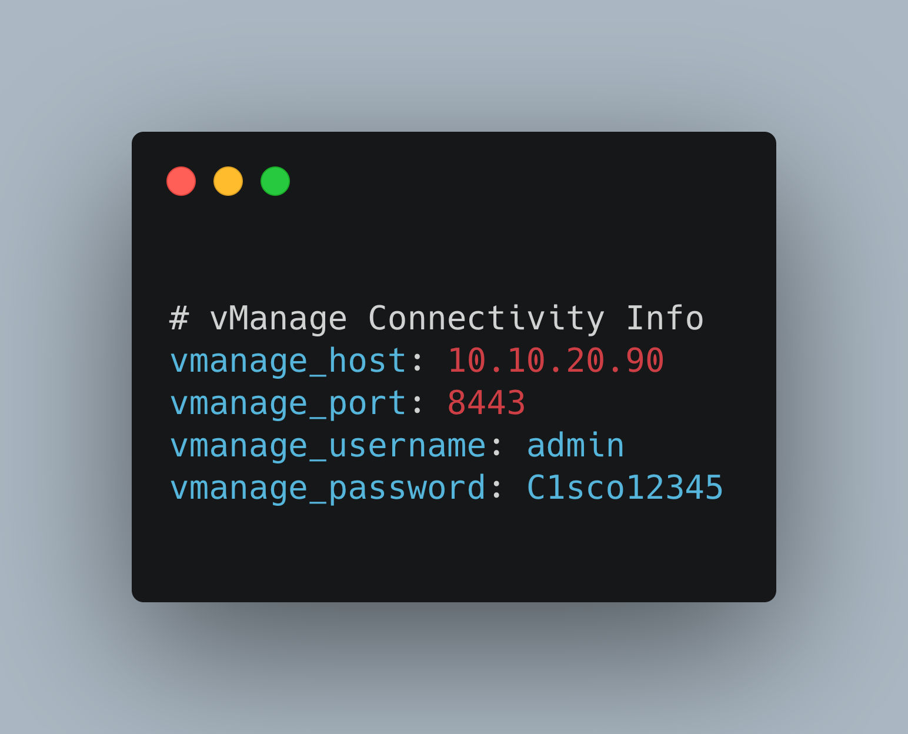
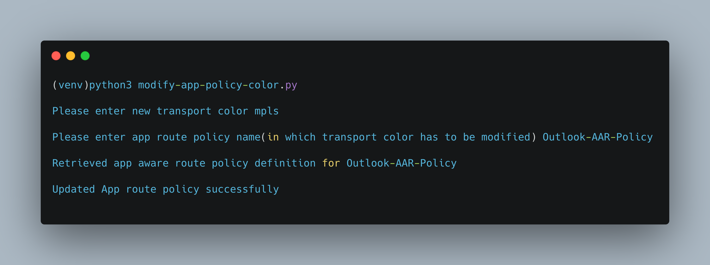

[](https://developer.cisco.com/codeexchange/github/repo/CiscoDevNet/sdwan-policy-automation)

# vManage APIs for Application Aware Routing Policies

This public repo contains python code that can be used to interact with the `Cisco SD-WAN vManage REST API`. The environment is pre-configured to access the [Cisco DevNet Reservable Sandbox for SD-WAN](https://devnetsandbox.cisco.com/RM/Diagram/Index/c9679e49-6751-4f43-9bb4-9d7ee162b069?diagramType=Topology) fabric.You can edit the variables in the environment to point to your own vManage instance. The code contains REST API calls to authenticate, modify preferred color in Application Aware Routing policy. Cisco SD-WAN vManage 19.2.2.


# Objective 

*   How to use vManage APIs to edit Application Aware Routing Policy.

# Requirements

To use this code you will need:

* Python 3.7+
* vManage user login details. (User should have privilege level to configure policies)

# Install and Setup

- Clone the code to local machine.

```
git clone https://github.com/ciscodevnet/sdwan-policy-automation.git
cd sdwan-policy-automation
```
- Setup Python Virtual Environment (requires Python 3.7+)

```
python3.7 -m venv venv
source venv/bin/activate
pip3 install -r requirements.txt
```

- YAML file **vmanage_login.yaml** with the Cisco SD-WAN Sandbox has been created  You can edit the variables in the environment to point to your own vManage instance.

## Example:



- To modify the preferred color in Application Aware Routing policy, run the script using command `python3 modify-app-policy-color.py` on macOS/Ubuntu env or `py -3.7 modify-app-policy-color.py` on windows env

## Sample Outputs



